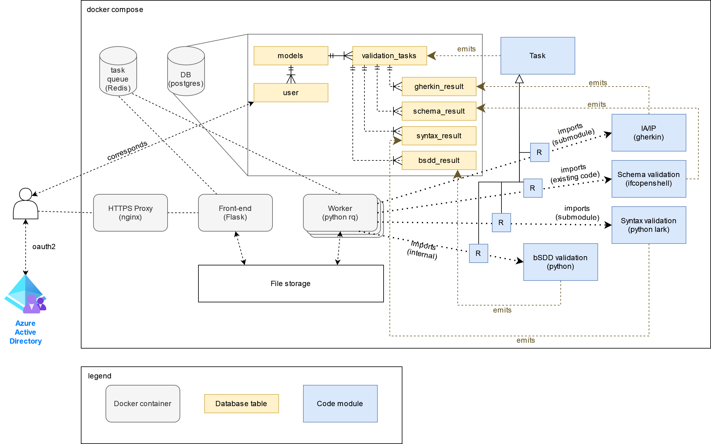

# buildingSMART validation service

ifc-pipeline is a processing queue that uses [IfcOpenShell](https://github.com/IfcOpenShell/IfcOpenShell/) to convert IFC input files into a graphic display using glTF 2.0 and [BIMSurfer2](https://github.com/AECgeeks/BIMsurfer2/) for visualization. There is a small web application in Flask that accepts file uploads. HTTPS is provided by Nginx. Everything is tied together using Docker Compose.

## Validation

For buildingSMART international, ifc-pipeline has been adapted to perform IFC file validation on (currently) 4 levels:

1. IFC-SPF syntax using https://github.com/IfcOpenShell/step-file-parser
2. Schema validation ([inverse] attribute types and cardinalities) using https://github.com/IfcOpenShell/IfcOpenShell/blob/v0.7.0/src/ifcopenshell-python/ifcopenshell/validate.py
3. Informal Propositions (IP) and Implementer Agreements (IA) using behavioural driven development and the Gherkin language
4. bSDD integrity

## Architecture

The service is deployed using docker compose. 

The deployment consists of a python front-end and worker(s) (using the same underlying docker container), nginx proxy, postgres database and redis for implementing a synchronised task queue.

Uploaded models are stored on disk.

The worker executes a series of validation tasks on the models. These are all modules that can act as stand-alone code repositories in themselves. For the purpose of the validation service, they each have an associated runner task that knows how to invoke the module, capture output and write to the database.

## Database schema

## Usage

~~~
./init.sh my.domain.name.com
docker-compose up -d
~~~

## Development notes

Remember to store credentials as environment variables in `/etc/environment`

### Nginx proxy on dev server

~~~
apt install nginx snapd
snap install --classic certbot
certbot --nginx
~~~

Add section below to /etc/nginx/sites-enabled/default

~~~
        client_max_body_size 4G;
        keepalive_timeout 5;

        location @app {
        proxy_pass http://localhost:5000;
        proxy_redirect off;

        proxy_set_header   Host                 $http_host;
        proxy_set_header   X-Real-IP            $remote_addr;
        proxy_set_header   X-Forwarded-For      $proxy_add_x_forwarded_for;
        proxy_set_header   X-Forwarded-Proto    $scheme;
    }
~~~ 

Comment out lines (not consecutive in file)

~~~
root /var/www/html;
index index.html index.htm index.nginx-debian.html;
~~~

Change to

~~~
try_files $uri @app;
~~~

Finally run to restart nginx

~~~
systemctl restart nginx
~~~

Start flask with

~~~
./run_local.sh
~~~
